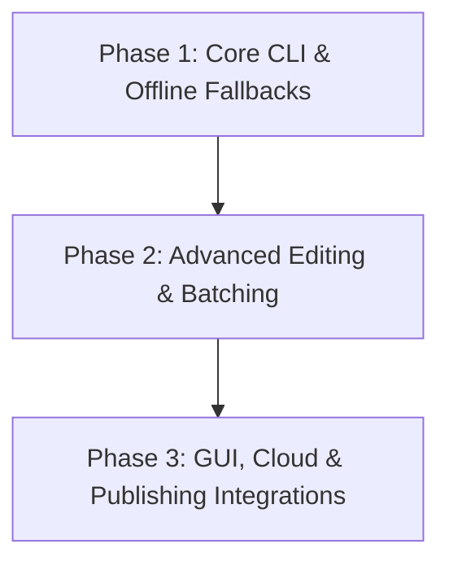

# Founder Note Toolkit (FNT) - Product Roadmap

This document outlines the planned timeline and upcoming feature implementations for the Founder Note Toolkit.

---

## 🗺️ Release Phases

---

## 📋 Roadmap Details

### Phase 1: Core CLI & Offline Fallbacks (Current Release v1.0.0)
* [x] **Smart Range Downloads**: Avoid large downloads using yt-dlp section hooks.
* [x] **Multiple Subtitle Streams**: Manual and automatic VTT downloads in Arabic & English.
* [x] **Transcoding Pipelines**: Automatic conversion of AV1 streams to H264/AAC.
* [x] **Keywords Timestamping**: Search and locate transcript matches.
* [x] **AI Segmentation & Heuristics**: Segment videos using Gemini/OpenAI or local rules.
* [x] **Caption Burning**: Burn subtitles directly onto clips.
* [x] **Configuration Store**: Local JSON settings for folders and API keys.

---

### Phase 2: Advanced Editing & Batching (Q3 2026)
* **Auto-Reframing (Landscape to Vertical)**:
  * Integrate lightweight machine learning (e.g., face detection or YOLO) to automatically crop standard 16:9 videos into 9:16 vertical shorts while tracking the speaker.
* **Batch Downloader & Scanner**:
  * Feed FNT a full playlist URL or list of links to download, transcribe, and analyze in bulk.
* **Dynamic Styled Subtitles**:
  * Expand caption burning to support customized ASS subtitles (different colors, fonts, shadow effects, and active-word animations similar to modern social media shorts).
* **Multi-Language AI Subtitle Translations**:
  * Local translation of transcript files using offline models or translation APIs.

---

### Phase 3: GUI, Cloud & Publishing Integrations (Q4 2026)
* **Interactive Web GUI (Streamlit / Next.js)**:
  * Provide an optional local web dashboard for users who prefer visual timelines, drag-and-drop subtitle editors, and video previews.
* **Direct Social Media API Publishing**:
  * Publish generated clips directly to TikTok, YouTube Shorts, and Instagram Reels from the terminal.
* **Whisper Integration**:
  * Allow transcribing arbitrary local video/audio files using local OpenAI Whisper models without requiring YouTube subtitles.
