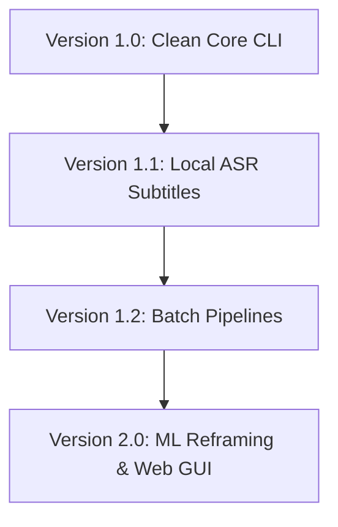

# Product Roadmap

This document outlines the development trajectory of the Founder Note Toolkit (FNT).

---

## 🗺️ Version Timeline

---

## 📋 Release Plans

### Version 1.0 - Production CLI Core (Current Release)
Focuses on stable, reliable downloading, transcoding, and transcribing of YouTube clips with fallback rules-based algorithms and verified quality configurations:
* [x] **Smart Range Downloads**: Avoid large downloads using yt-dlp section hooks.
* [x] **Transcoding Pipelines**: Automatic conversion of AV1 streams to H264/AAC.
* [x] **Multi-format Subtitles**: VTT extraction to TXT, JSON, and SRT.
* [x] **Local Heuristics Fallback**: Rules-based AI fallback segment analysis when API keys are absent.
* [x] **Safe Filename Sanitization**: Windows MAX_PATH and reserved device name protection.
* [x] **Corrupted Configuration Healing**: Automatic restoration of configuration defaults.
* [x] **Robust Path Escaping**: Protection against path whitespaces, colons, and quotes inside FFmpeg subtitle filters.

---

### Version 1.1 - Local ASR & Subtitle Styles (Q3 2026)
Expands transcription features to local media files without requiring YouTube subtitle availability:
* **Whisper Integration**: Include local transcription capability for arbitrary audio and video files using OpenAI Whisper.
* **Custom Subtitle Burner Styles**: Allow user-customized font sizes, font families, overlay backgrounds, text colors, and shadows when hard-coding captions.

---

### Version 1.2 - Batch Processing & Automated Playlists (Q4 2026)
Optimizes operations for power users editing collections of videos:
* **Batch Downloader**: Supply a file containing multiple YouTube URLs or a playlist URL to transcribe, analyze, and segment videos in bulk.
* **Metadata Export Automation**: Automatically gather channel metadata logs to keep folders unified.

---

### Version 2.0 - Subject Face Tracking & Web UI (Q1 2027)
Major upgrade focusing on computer vision reframing and graphic user interfaces:
* **Dynamic 9:16 Auto-Reframing**: Integrate lightweight ML models (like face/object detection) to automatically crop 16:9 videos into vertical 9:16 reels while tracking the primary speaker.
* **Interactive Web GUI**: A local web interface (using Streamlit or Next.js) enabling visual editing of subtitle text, audio track shifting, and timeline clip trimming.
